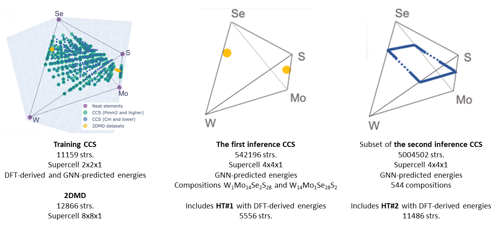

# 2DMaterialsGraphHull

**2DMaterialsGraphHull** provides the composition/configuration-space (CCS) datasets, DFT and graph neural network (GNN) energetics, and post-processing code developed for studying chemical disorder and point defects in two-dimensional transition metal dichalcogenide (TMD) monolayers — alloyed and defected MeX₂ (Me = Mo, W; X = S, Se) systems.

<p align="center">
  
</p>


---

## Table of Contents

- [Overview](#overview)
- [Repository Structure](#repository-structure)
- [Data Requirements](#data-requirements)
- [Installation and Usage](#installation-and-usage)
- [Dependencies](#dependencies)
- [Model Naming Convention](#model-naming-convention)
- [Related Repositories](#related-repositories)
- [Citation](#citation)
- [License](#license)

---

## Overview

Modeling disorder and defects in 2D materials is hard because the number of possible atomic arrangements grows combinatorially with supercell size, which puts exhaustive first-principles treatment out of reach. This project addresses that with a workflow that combines:

- **Symmetry-aware configuration sampling (CCS)** — enumeration of symmetrically inequivalent defect/alloy arrangements in MeX₂ supercells, built with the *Supercell* program and analyzed with *Spglib*/*pymatgen*, while retaining the degeneracy weights needed for thermodynamic averaging.
- **DFT calculations (VASP, PBE)** — reference formation energies and relaxed structures for training, validation, and holdout evaluation.
- **GNN inference (Allegro and NequIP, E(3)-equivariant)** — models trained on different CCS- and 2DMD-derived subsets (including low- and high-defect-concentration splits) to predict energetics of unrelaxed configurations at scale, letting convex-hull and finite-temperature free-energy analysis be carried out across full configuration sets rather than sparse samples.
- **Configurational entropy / finite-temperature free energy** — partition-function-based evaluation of ΔG using CCS weights, to go beyond 0 K convex-hull screening.
- **Interpretable ML (Ridge Regression / Random Forest on defect-count descriptors)** — used to relate local defect motifs to energetic favorability alongside the GNN-based analysis.

Two complementary data sources feed this workflow:

- **CCS (Composition/Configuration Space)** — the symmetry-unique defect/alloy configurations generated and DFT/GNN-evaluated in this work.
- **2DMD dataset** — an existing library of 2D-material point-defect structures (Huang P., Lukin R., et al. Unveiling the complex structure-property correlation of defects in 2D materials based on high throughput datasets, *npj 2D Mater Appl* **7**, 6 (2023)), processed and augmented here via the companion [2DMD_at_a_Glance](https://github.com/AIRI-Institute/2DMD_at_a_Glance) code for use as additional training/validation/holdout data.

The notebooks in this repository carry out CCS statistics and symmetry analysis, convex-hull construction and comparison of DFT vs. GNN energetics, holdout testing of the trained models (preliminary tests plus two inference CCS holdout tests, HT#1 and HT#2), configurational-entropy/free-energy evaluation, and descriptor-based interpretability.

---

## Repository Structure

| File                         | Description                                                                                                                                                                                       |
|------------------------------|---------------------------------------------------------------------------------------------------------------------------------------------------------------------------------------------------|
| `train_ccs_statistics.ipynb` | Exploratory analysis of the training CCS dataset: space-group distributions, pairwise correlations, and heatmaps of defect counts.                                                                |
| `convex_hull_analysis.ipynb` | Construction and visualization of the convex hull in the composition simplex, calculation of `E_above_hull`, and comparison between DFT and GNN predictions using training CCS and 2DMD datasets. |
| `preliminary_test.ipynb`     | Preliminary evaluation of model performance on test part of training CCS dataset with space groups below a symmetry threshold (P1, Cm, etc.).                                                     |
| `holdout_test_1.ipynb`       | First holdout test (HT#1): evaluation of GNN models on DFT-derived structures from the first inference CCS.                                                                                       |
| `holdout_test_2.ipynb`       | Second holdout test (HT#2): evaluation of GNN models on structures selected from the second inference CCS, including hull-energy predictions and configurational entropy analysis.                |                                                           |
| `tools.py`                   | Utility functions for data processing, simplex coordinates, convex hull, entropy calculations, and structure manipulation.                                                                        |
| `requirements.txt`           | List of Python dependencies.                                                                                                                                                                      |
| `data/`                      | Datasets (see below for details).                                                                                                                                                                 |

---

## Data Requirements

The notebooks expect the following datasets in `data/` directory.


| Dataset                                     | Description                                                                                                                                                                                                    |
|---------------------------------------------|----------------------------------------------------------------------------------------------------------------------------------------------------------------------------------------------------------------|
| `2d-materials-point-defects-all-table`      | Processed 2DMD dataset (12866 samples).                                                                                                                                                                        |
| `neat_elements-dft_subset`                  | Reference DFT-derived energies of the pure elements (W, Mo, Se, S) (4 samples).                                                                                                                                |
| `train_ccs-gnn_predictions_dft_subset`      | Training CCS with detailed description of structures, DFT-derived and GNN-predicted energies (11159 samples).                                                                                                  |
| `train_ccs-2dmd-convex_hull`                | Training CCS and 2DMD structures with convex-hull energies and compositional simplex coordinates (11159 + 12866 + 4 samples).                                                                                  |
| `2dmd-W1Mo14Se2S28_W14Mo1Se28S2-dft_subset` | The most favorable/unfavorable structures of 2DMD dataset with W<sub>1</sub>Mo<sub>14</sub>Se<sub>2</sub>S<sub>28</sub> and W<sub>14</sub>Mo<sub>1</sub>Se<sub>28</sub>S<sub>2</sub> compositions (4 samples). |
| `inference1_ccs-dft_subset`                 | Subset of the first inference CCS with DFT-derived energies (HT#1) (5556 samples).                                                                                                                             |
| `inference1_ccs-gnn_predictions_subset`     | The first inference CCS with GNN-predicted energies (542196 samples).                                                                                                                                          |
| `inference2_ccs-composition_size`           | Numbers of symmetry-inequivalent structures corresponding to each composition in the second inference CCS (544 samples).                                                                                       |
| `inference2_ccs-gnn_predictions_subset`     | Subset of the second inference CCS with GNN-predicted energies (5004502 samples). It contains 11486 HT#2 structures with DFT-derived energies.                                                                 |

---

## Installation and Usage

1. Clone the repository:
   ```bash
   git clone https://github.com/AIRI-Institute/2DMaterialsGraphHull.git
   cd 2DMaterialsGraphHull
   ```
2. Create a Python virtual environment, activate it and install dependencies:
   ```bash
   python -m venv .venv
   source .venv/bin/activate
   pip install -r requirements.txt
   ```
3. Use the [2DMD_at_a_Glance](https://github.com/AIRI-Institute/2DMD_at_a_Glance) project to prepare the `2d-materials-point-defects-all-table` dataset and place it in the `data/` directory. The [CSSLib](https://github.com/AIRI-Institute/CSSLib) library (used to generate and analyze the CCSs themselves) is available separately.
4. Download datasets to `data/` directory by links below:
   - [neat_elements-dft_subset](https://2d-materials-graph-hull.obs.ru-moscow-1.hc.sbercloud.ru/neat_elements-dft_subset.pkl.gz)
   - [train_ccs-gnn_predictions_dft_subset](https://2d-materials-graph-hull.obs.ru-moscow-1.hc.sbercloud.ru/train_ccs-gnn_predictions_dft_subset.pkl.gz)
   - [train_ccs-2dmd-convex_hull](https://2d-materials-graph-hull.obs.ru-moscow-1.hc.sbercloud.ru/train_ccs-2dmd-convex_hull.pkl.gz)
   - [2dmd-W1Mo14Se2S28_W14Mo1Se28S2-dft_subset](hhttps://2d-materials-graph-hull.obs.ru-moscow-1.hc.sbercloud.ru/2dmd-W1Mo14Se2S28_W14Mo1Se28S2-dft_subset.pkl.gz)
   - [inference1_ccs-dft_subset](https://2d-materials-graph-hull.obs.ru-moscow-1.hc.sbercloud.ru/inference1_ccs-dft_subset.pkl.gz)
   - [inference1_ccs-gnn_predictions_subset](https://2d-materials-graph-hull.obs.ru-moscow-1.hc.sbercloud.ru/inference1_ccs-gnn_predictions_subset.pkl.gz)
   - [inference2_ccs-composition_size](https://2d-materials-graph-hull.obs.ru-moscow-1.hc.sbercloud.ru/inference2_ccs-composition_size.pkl.gz)
   - [inference2_ccs-gnn_predictions_subset](https://2d-materials-graph-hull.obs.ru-moscow-1.hc.sbercloud.ru/inference2_ccs-gnn_predictions_subset.pkl.gz)
5. Launch Jupyter Lab or Notebook:
   ```bash
   jupyter lab
   ```
Each notebook in the repository contains detailed comments and can be executed independently once the required data is in place.

---

## Dependencies

Main packages (see `requirements.txt`):

- Python ≥ 3.10
- Jupyter, Matplotlib, NumPy, Pandas, Plotly, Seaborn
- PyMatGen (structure manipulation, space-group analysis)
- SciPy, scikit-learn (Ridge Regression, Random Forest, GridSearchCV)
- NetworkX

GNN models (Allegro, NequIP) are not included here; the notebooks read pre-computed predictions from the inference files. Model training used the *AFLOWLib*-derived pretraining set alongside CCS- and 2DMD-based fine-tuning data, as described in the paper's Methods section.

---

## Model Naming Convention

Trained/inference model identifiers follow the pattern:

```
architecture_(pretrain set)_(training/fine-tuning dataset)
```

e.g., a model named `allegro_random_2dmd-ldc` refers to the *Allegro* architecture, pretrained on the random-sampling pretraining set, and fine-tuned on the low-defect-concentration (LDC) 2DMD subset. Use this convention to identify which model produced a given set of predictions in the inference files.

---

## Related Repositories

- [2DMD_at_a_Glance](https://github.com/AIRI-Institute/2DMD_at_a_Glance) — data processing, unification, and augmentation of the 2DMD datasets.
- [CSSLib](https://github.com/AIRI-Institute/CSSLib) — generation of composition/configuration spaces (CCSs) and analysis of their space-group/group-subgroup relations.

---

## Citation

If you use this work, please cite the accompanying paper:

```
@article{eremin2026chemical,
  title={Chemical disorder and defects in MeX$_2$ (Me = Mo, W; X = S, Se) monolayers by means of data-driven approach},
  author={Eremin R.A., Krautsou A.V., Humonen I.S., Ryabov A.A., Khrabrov K.A., Dembitskiy A.D., Antropov A.S., Efimov A.R., Novoselov K.S., Budennyy S.A.},
  year={2026}
}
```

---

## License

This project is licensed under the MIT License — see the [LICENSE](LICENSE) file for details.
